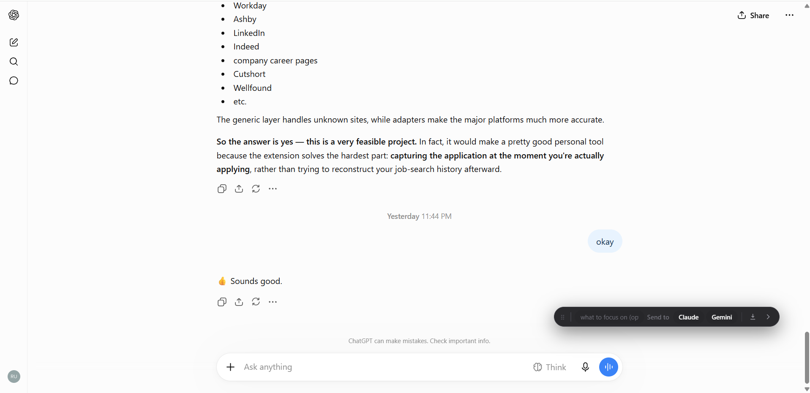
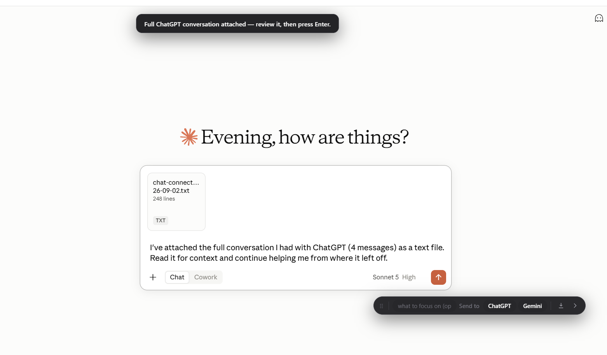

# Chat Connect

Carry an in-progress conversation between ChatGPT, Claude, and Gemini.

You're mid-conversation on ChatGPT, you hit the free-tier wall or want a second
opinion. Click **Send to Claude**. A new tab opens with the whole thread already
attached as a text file, plus a line saying what it is — and whatever you typed
in the **what to focus on** box. Review it, press Enter, keep going.

No account, no server, no data leaves your browser. The conversation is held in
`chrome.storage.local` for the few seconds between the two tabs, then deleted.



One click later, in Claude — the whole conversation attached as a text file,
with a line saying what it is:



## Install (unpacked)

1. `chrome://extensions` → enable **Developer mode**
2. **Load unpacked** → select this folder
3. Open a conversation on ChatGPT, Claude, or Gemini

Use either the floating **Send to** bar on the page or the toolbar popup.

## How it works

| Step | Where |
|---|---|
| Scrape the open thread | `content.js` → `scrapeThread` |
| Attach the thread as a `.txt` | `content.js` → `attachFile` |
| Format with context framing | `lib/format.js` → `toPrompt` |
| Stage for the target tab | `content.js` → `handoff` |
| Paste on arrival | `content.js` → `consumePending` → `insertText` |

It pastes but never sends. The send button's disabled state is the least stable
thing on these pages, and auto-sending would spend a message from your quota on
text you hadn't read yet.

## Where the selectors live

Everything provider-specific is the `PROVIDERS` table at the top of
[`content.js`](content.js) — message selectors, composer selector, and a
`charLimit`. These sites redesign often, so **when a provider breaks, that table
is the only thing to fix.** Adding a fourth provider is one more entry.

Conversations transfer as a `.txt` attachment with a short covering note, so a
long thread is never trimmed. If a provider's upload path can't be driven, it
falls back to pasting inline, and `charLimit` (40000 chars) bounds that fallback
only -- there, older messages are dropped first, always keeping the opening one
since it usually carries the task framing.

If the paste ever fails — a redesign, or you aren't signed in to the target —
you get a **Copy conversation** button rather than a lost thread.

## Test

```
node test/format.test.js
```

Covers the pure formatting and truncation logic. The scrape and paste paths need
a signed-in browser; see the manual matrix in the plan.

## Contributing

Adding a fourth provider is one entry in a table and needs no understanding of
the rest — see [CONTRIBUTING.md](CONTRIBUTING.md). When a transfer breaks it is
almost always one stale selector; the console prints which one.

## Status

v1.0.0.

Not planned: a saved-thread library, auto-send, and an MCP server that would
expose threads to Cursor and Claude Code. The scraped thread is versioned JSON
(`v: 1`) specifically so that last one can be added without a rewrite.

## License

[MIT](LICENSE)
